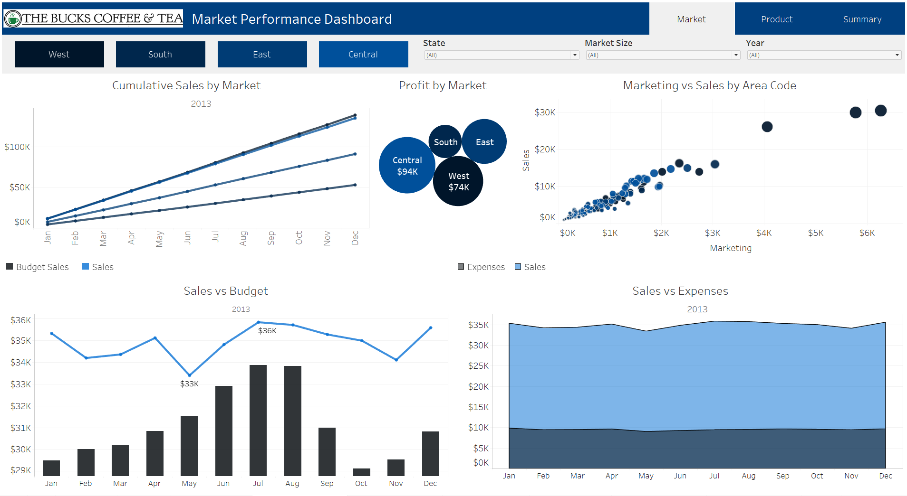
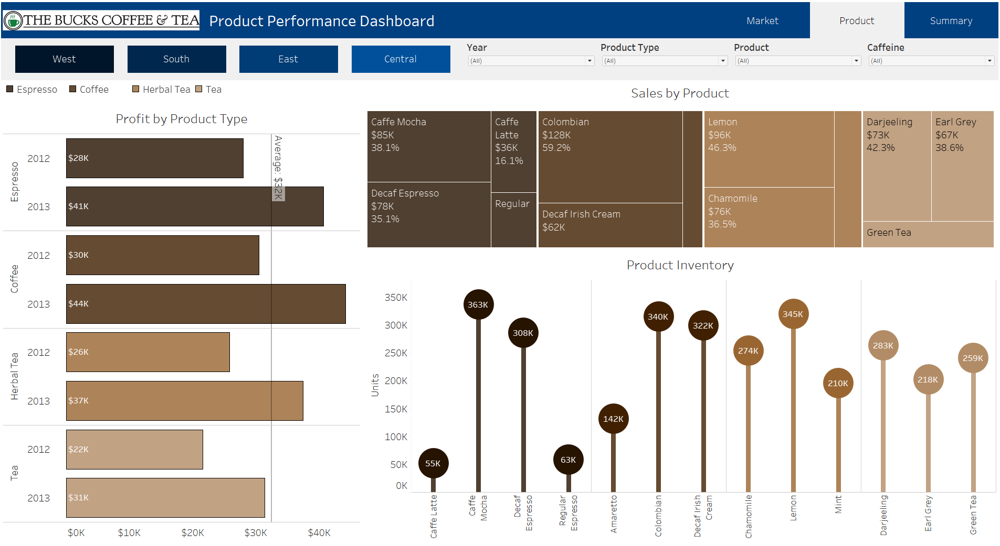

# Coffee Retail Chain - Sales Dashboard & Analysis  
- Description: Tableau dashboards and sales analysis storyboard for a coffee retail chain  
- Created: 6/10/23    
  
## Overview:  
- For this project, I created an imaginary retail chain called "The Bucks Coffee & Tea".  
- Acting as an analyst for The Bucks, I developed market and product performance dashboards for calendar years 2012 and 2013.  
- I then analyzed 2013 performance and created an executive summary as a Tableau storyboard.   
  
## Files:  
- Data File: [Coffee.xlsx](Coffee.csv) from <a src="https://www.kaggle.com/datasets/arjunbhaybhang/coffee-chains-dataset?select=Coffee.csv" target="_blank">kaggle.com</a>
- Tableau File: 
    
## Market Performance Dashboard:
- The Market Performance Dashboard can be filtered in various ways to allow users to gain insights into different aspects of performance.  
- Data can be viewed at the market or state level, by market size (major or small), and by year.  
- The following charts were used to visualize the data:  
    - Cumulative Sales by Market: Line Chart  
    - Profit by Market: Packed Bubble Chart
    - Marketing vs Sales by Area Code: Scatter Plot
    - Sales vs Budget: Combination Chart
    - Sales vs Expenses: Area Chart
  
  
  
## Product Performance Dashboard:  
- The Product Performance Dashboard can be filtered in various ways to allow users to gain insights into different aspects of performance.
- Data can be viewed at the market level, by year, product type, product, and caffeine content.  
- The following types of charts were used to visualize the data:  
    - Profit by Product Type: Bar Chart
    - Sales by Product Type: Treemap Chart
    - Product Inventory: Lollipop Chart
    
  
  
## Executive Summary Storyboard:  
- The Executive Summary outlines key insights into market and product performance gained from analyzing the data. 
- The Storyboard tells the story of the company's performance by incorporating visuals from the dashboards, in addition to the following:
    - Sales by Market and State: Dual Layer Map
    - Cumulative Sales Year over Year: Table

View the Storyboard:  

   
   
   
   
   
      
